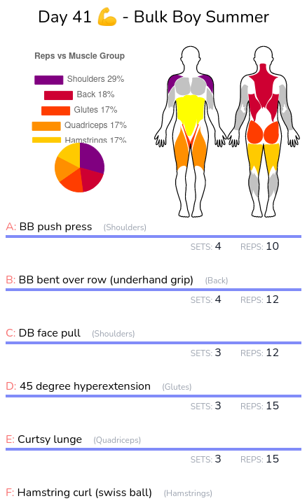
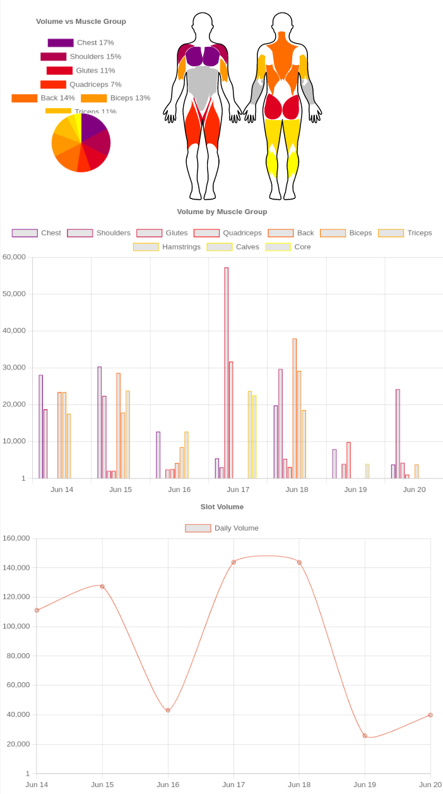
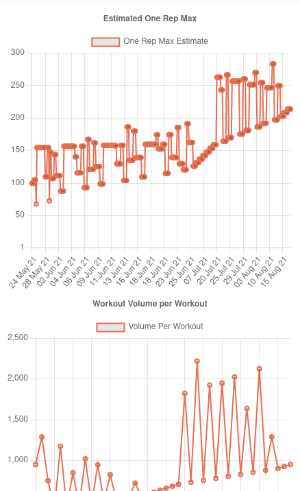
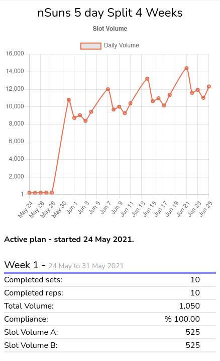
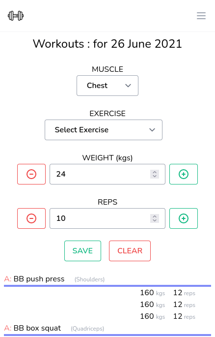
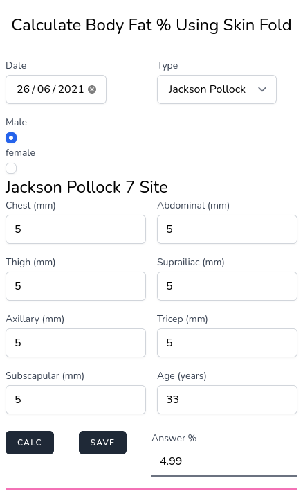
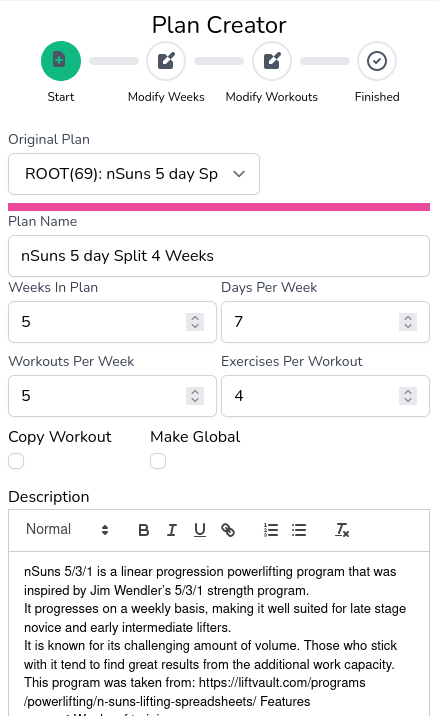
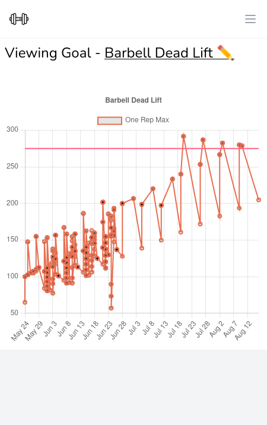
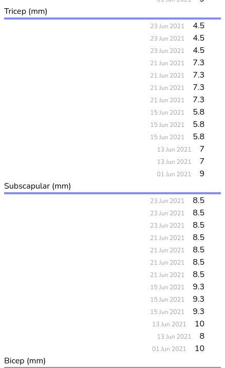
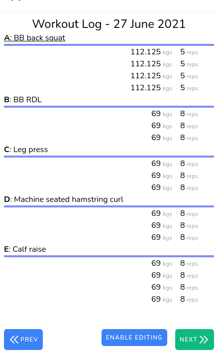

#   DINGBAT.APP


Track your workouts, strength progression and more!
===================================================

### All your body building data in one place. Never miss a workout again!

Features
========

### Rich dashboard

Daily dashboard show's targeted muscles, upcoming working and completed workouts.





### In depth statistics

Weekly/Monthly charts and statistics for workout volume and strength gains.

### Exercise history

Exercise specific dashboards to view volume history and strength progression.





### Follow complex plans/splits

Support for complicated plans that include 1RM percentages, AMRAP, TUT and more.

### Log sets

Log rets/reps and track personal bests. Weights are automatically calculated for 1RM plans (nSuns, Wendler etc).





### Calculate and track body statistics

Log and track weight, skin fold and measurements.

### Create custom plans

Use the plan wizard to create complex plans from scratch or modify existing plan. You can share plans with friends by making them global!





### Create goals and track progress

Goals can be created for any time frame or metric on the app. Including weight, body measurements, skin fold measurements, body fat percentage, one rep max etc

### Track your measurements

All measurements are recorded and can be reviewed to see your progress. To create graphs use the goal creator.





### View workout diary/log

Your workout log shows all the workouts done on a date across any plan selected. This is a digital record of your work in the gym.


# Dingbat.app 
This Github page contains the source code for my website (dingbat.app).

It uses Laravel and Livewire with Mysql. I wrote it two years ago and still use it daily so I decided I would open-source it. I welcome pull requests.

## Installation
You will need to install PHP-8.0.

On Ubuntu:
> sudo apt install php8.0 php8.0-fpm libapache2-mod-php8.0 php8.0-mbstring php8.0-cli php8.0-bcmath php8.0-xml php8.0-zip  php8.0-mysql php8.0-curl php-gd
> sudo apt install composer
> sudo apt install mysql-server

## setup

First you need to create the MySQL databases:

> create user 'dingbatexampleuser'@'localhost' IDENTIFIED BY 'dingbatexamplepassword';
> grant all privileges on dingbatexample.* to 'dingbatexampleuser'@'localhost';
> flush privileges;
> create database dingbatexample;

Then run the composer commands:
> composer install

Copy the example .env file and change your parameters as necessary:
> cp .env.example .env

Run artisan commands:
> php artisan key:generate
> php artisan migrate
> php artisan db:seed
> php artisan serve 

You will now be able to create a user and start using the application :)

## Nginx setup

Place the files in /var/www/dingbat

Edit /etc/nginx/sites-available/dingbat.app:
```angular2html
server {
    server_name dingbat.app;
    listen 80;
}
server {
    server_name dingbat.app;
    root /var/www/dingbat.app/public;

    add_header X-Frame-Options "SAMEORIGIN";
    #add_header X-XSS-Protection "1; mode=block";
    add_header X-Content-Type-Options "nosniff";

   fastcgi_buffers 16 16k; 
   fastcgi_buffer_size 32k;
   
 index index.php;
    charset utf-8;

    location / {
        try_files $uri $uri/ /index.php?$query_string;
    }

    location = /favicon.ico { access_log off; log_not_found off; }
    location = /robots.txt  { access_log off; log_not_found off; }

    error_page 404 /index.php;

    location ~ \.php$ {
        fastcgi_pass unix:/var/run/php/php8.0-fpm.sock;
        fastcgi_param SCRIPT_FILENAME $realpath_root$fastcgi_script_name;
        include fastcgi_params;
    }

    location ~ /\.(?!well-known).* {
        deny all;
    }
}

```

Refer to the nginx documentation for further steps.

Then run certbot by letsencrypt to enable SSL. Change these parameters to suit your URL.